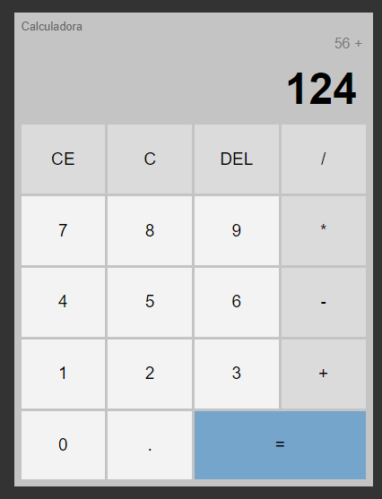

# Calculadora Simples em HTML, CSS e JavaScript

Este é um projeto de uma calculadora simples desenvolvida com HTML, CSS e JavaScript.

## Visão Geral

Uma calculadora básica que executa operações matemáticas simples. Este projeto foi criado como uma maneira de praticar e demonstrar conceitos de desenvolvimento web.

## Funcionalidades

- Adição, subtração, multiplicação e divisão de números.
- Operações com decimais.
- Lida com operações simples de forma clara e intuitiva.

## Tecnologias Utilizadas

- HTML
- CSS
- JavaScript

## Pré-visualização

## Instalação e Uso

1. Faça o download ou clone o repositório.
2. Abra o arquivo `index.html` em um navegador web.
3. Use a calculadora para realizar operações matemáticas simples.

## Autor

[Breno Boaventura](https://github.com/brenoboaventura321)